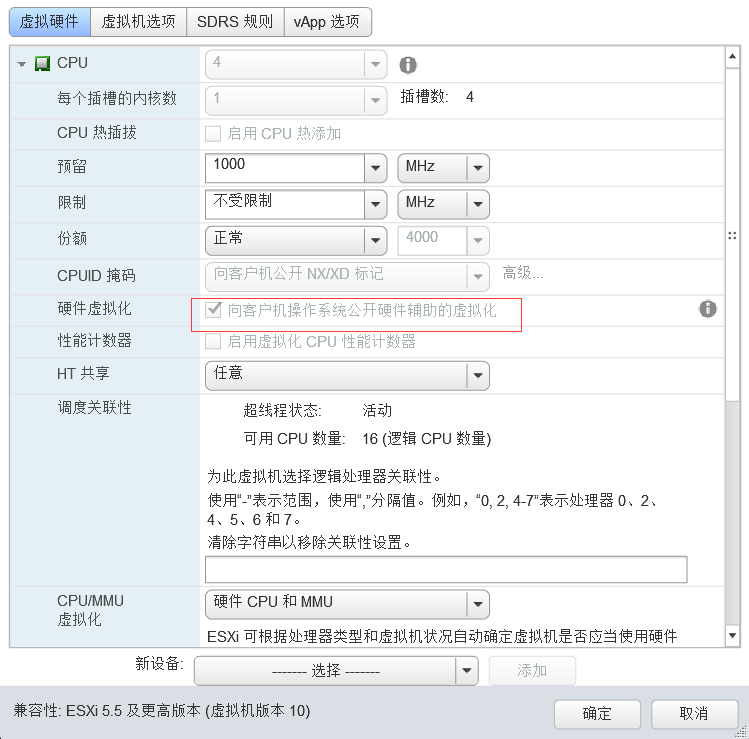

# 环境准备

## 操作系统版本

```text
openSUSE Leap 15.0 x64
```

## 虚拟机配置

主机名|CPU|内存|硬盘|网卡|角色
:---:|:---:|:---:|:---:|:---:|:---:
ctl|4(开启VT)|16G|50G|2*1GE|控制和网络节点
com01|4(开启VT)|16G|50G|2*1GE|计算节点
com02|4(开启VT)|16G|50G|2*1GE|计算节点和存储节点

## IP地址规划

主机名|admin网络IP|MGMT网络IP|网关
:---:|:---:|:---:|:---:
ctl|172.16.16.192/24|172.16.160.192/24|172.16.16.1
com01|172.16.16.195/24|172.16.160.195/24|172.16.16.1
com02|172.16.16.227/24|172.16.160.227/24|172.16.16.1

## 虚拟机开启VT

在VMware的Web Client中编辑虚拟机的CPU参数，根据下图开启CPU VT特性。


## 时间同步

采用openSUSE Leap 15.0系统自带的chrony从互联网同步时间。

```bash
> chronyc sources
210 Number of sources = 3
MS Name/IP address         Stratum Poll Reach LastRx Last sample
===============================================================================
^- ntp.wdc1.us.leaseweb.net      2   8   277   241    -67ms[  -69ms] +/-  371ms
^- cn.ntp.faelix.net             2   8   175   821    -22ms[  -24ms] +/-  133ms
^* static-5-103-139-163.ip.>     1   8   377   235  -6691us[-9058us] +/-  134ms
```

## 密码生成

生成密码供后续使用：

```bash
root@ctl ~> openssl rand -hex 10
9299d4fd3a922bd4ae52
```

## 关闭firewalld

```bash
> systemctl disable firewalld && systemctl stop firewalld
```

## 配置hosts

```text
172.16.160.192  ctl
172.16.160.195  com01
172.16.160.227  com02
```

* 除了增加各节点的名称解析以外，还要将本机的主机名写入到`127.0.0.1  localhost`后面，避免部分服务启动出现问题。

## 安装openstack包

```bash
> zypper addrepo -f obs://Cloud:OpenStack:Rocky/openSUSE_Leap_15.0 Rocky
> zypper install python-openstackclient
> openstack complete --shell bash > /etc/bash_completion.d/openstack.bash_completion
```

* 通过OBS增加Rocky版本openstack源，所有节点安装openstack相关软件包。

## 安装MySQL数据库

openstack使用MySQL存储集群信息，MySQL通常安装在Controller节点。

```bash
root@ctl ~> zypper install mariadb-client mariadb python-PyMySQL
```

```bash
root@ctl ~> vi /etc/my.cnf.d/openstack.cnf
[mysqld]
bind-address = 172.16.160.192

default-storage-engine = innodb
innodb_file_per_table = on
max_connections = 4096
collation-server = utf8_general_ci
character-set-server = utf8
```

```bash
root@ctl ~> systemctl enable mysql && systemctl start mysql
```

```bash
root@ctl ~> mysql_secure_installation

NOTE: RUNNING ALL PARTS OF THIS SCRIPT IS RECOMMENDED FOR ALL MariaDB
      SERVERS IN PRODUCTION USE!  PLEASE READ EACH STEP CAREFULLY!

In order to log into MariaDB to secure it, we'll need the current
password for the root user.  If you've just installed MariaDB, and
you haven't set the root password yet, the password will be blank,
so you should just press enter here.

Enter current password for root (enter for none):
OK, successfully used password, moving on...

Setting the root password ensures that nobody can log into the MariaDB
root user without the proper authorisation.

Set root password? [Y/n] y
New password:
Re-enter new password:
Password updated successfully!
Reloading privilege tables..
 ... Success!


By default, a MariaDB installation has an anonymous user, allowing anyone
to log into MariaDB without having to have a user account created for
them.  This is intended only for testing, and to make the installation
go a bit smoother.  You should remove them before moving into a
production environment.

Remove anonymous users? [Y/n] n
 ... skipping.

Normally, root should only be allowed to connect from 'localhost'.  This
ensures that someone cannot guess at the root password from the network.

Disallow root login remotely? [Y/n] n
 ... skipping.

By default, MariaDB comes with a database named 'test' that anyone can
access.  This is also intended only for testing, and should be removed
before moving into a production environment.

Remove test database and access to it? [Y/n] y
 - Dropping test database...
 ... Success!
 - Removing privileges on test database...
 ... Success!

Reloading the privilege tables will ensure that all changes made so far
will take effect immediately.

Reload privilege tables now? [Y/n] y
 ... Success!

Cleaning up...

All done!  If you've completed all of the above steps, your MariaDB
installation should now be secure.

Thanks for using MariaDB!
```

* MySQL root密码设置为生成的随机密码`9299d4fd3a922bd4ae52`；
* 删除匿名用户和test数据库。

## 安装消息队列

消息队列用于协调各服务的操作和状态，通常安装在Controller节点，openstack支持多种MQ，这里选用RabbitMQ消息队列。

```bash
root@ctl ~> zypper install rabbitmq-server
root@ctl ~> systemctl enable rabbitmq-server && systemctl start rabbitmq-server
```

增加RabbitMQ用户openstack，使用生成的随机密码。

```bash
root@ctl ~> rabbitmqctl add_user openstack 9299d4fd3a922bd4ae52
Creating user "openstack"
```

授权给openstack用户`配置、写、读`。

```bash
root@ctl ~> rabbitmqctl set_permissions openstack ".*" ".*" ".*"
Setting permissions for user "openstack" in vhost "/"
```

## 部署Memcached

Memcached用于缓存验证的token等信息，一般部署在Controller节点。

```bash
root@ctl ~> zypper install memcached python-python-memcached
```

配置Memcached服务监听在MGMT地址`172.16.160.192`。

```bash
root@ctl ~> vi /etc/sysconfig/memcached
MEMCACHED_PARAMS="-l 172.16.160.192"
```

启动Memcached。

```bash
root@ctl ~> systemctl enable memcached && systemctl start memcached
```

## 安装etcd

openstack可通过etcd保存配置信息，跟踪服务存活等，etcd目前发行版未提供安装包。

创建etcd组和用户。

```bash
root@ctl ~> groupadd --system etcd
root@ctl ~> useradd --home-dir "/var/lib/etcd" \
    --system \
    --shell /bin/false \
    -g etcd \
    etcd
```

创建etcd相应的目录。

```bash
root@ctl ~> mkdir -p /etc/etcd
root@ctl ~> chown etcd:etcd /etc/etcd
root@ctl ~> mkdir -p /var/lib/etcd
root@ctl ~> chown etcd:etcd /var/lib/etcd
```

下载安装etcd包。

```bash
root@ctl ~> ETCD_VER=v3.2.7
root@ctl ~> rm -rf /tmp/etcd && mkdir -p /tmp/etcd
root@ctl ~> curl -L \
    https://github.com/coreos/etcd/releases/download/${ETCD_VER}/etcd-${ETCD_VER}-linux-amd64.tar.gz \
    -o /tmp/etcd-${ETCD_VER}-linux-amd64.tar.gz
root@ctl ~> tar xzvf /tmp/etcd-${ETCD_VER}-linux-amd64.tar.gz \
    -C /tmp/etcd --strip-components=1
root@ctl ~> cp /tmp/etcd/etcd /usr/bin/etcd
root@ctl ~> cp /tmp/etcd/etcdctl /usr/bin/etcdctl
```

配置etcd。

```bash
root@ctl ~> vi /etc/etcd/etcd.conf.yml
name: controller
data-dir: /var/lib/etcd
initial-cluster-state: 'new'
initial-cluster-token: 'etcd-cluster-01'
initial-cluster: controller=http://172.16.160.192:2380
initial-advertise-peer-urls: http://172.16.160.192:2380
advertise-client-urls: http://172.16.160.192:2379
listen-peer-urls: http://0.0.0.0:2380
listen-client-urls: http://172.16.160.192:2379
```

创建systemd服务启动。

```bash
root@ctl ~> vi /usr/lib/systemd/system/etcd.service
[Unit]
After=network.target
Description=etcd - highly-available key value store

[Service]
LimitNOFILE=65536
Restart=on-failure
Type=notify
ExecStart=/usr/bin/etcd --config-file /etc/etcd/etcd.conf.yml
User=etcd

[Install]
WantedBy=multi-user.target
```

启动服务。

```bash
root@ctl ~> systemctl daemon-reload
root@ctl ~> systemctl enable etcd && systemctl start etcd
```

## TroubleShooting

### RabbitMQ启动失败

```bash
root@ctl ~> systemctl start rabbitmq-server
Job for rabbitmq-server.service failed because the control process exited with error code.
See "systemctl  status rabbitmq-server.service" and "journalctl  -xe" for details.

root@ctl ~> systemctl status rabbitmq-server.service
● rabbitmq-server.service - RabbitMQ broker
   Loaded: loaded (/usr/lib/systemd/system/rabbitmq-server.service; enabled; vendor preset: disabled)
   Active: failed (Result: exit-code) since Sat 2018-11-24 01:19:50 CST; 1min 41s ago
  Process: 7343 ExecStart=/usr/sbin/rabbitmq-server (code=exited, status=1/FAILURE)
 Main PID: 7343 (code=exited, status=1/FAILURE)

Nov 24 01:19:49 ctl systemd[1]: Starting RabbitMQ broker...
Nov 24 01:19:50 ctl systemd[1]: rabbitmq-server.service: Main process exited, code=exited, status=1/FAILURE
Nov 24 01:19:50 ctl systemd[1]: Failed to start RabbitMQ broker.
Nov 24 01:19:50 ctl systemd[1]: rabbitmq-server.service: Unit entered failed state.
Nov 24 01:19:50 ctl systemd[1]: rabbitmq-server.service: Failed with result 'exit-code'.
```

* 名称解析问题，在/etc/hosts里增加记录`127.0.0.1    ctl`，重启RabbitMQ服务器。